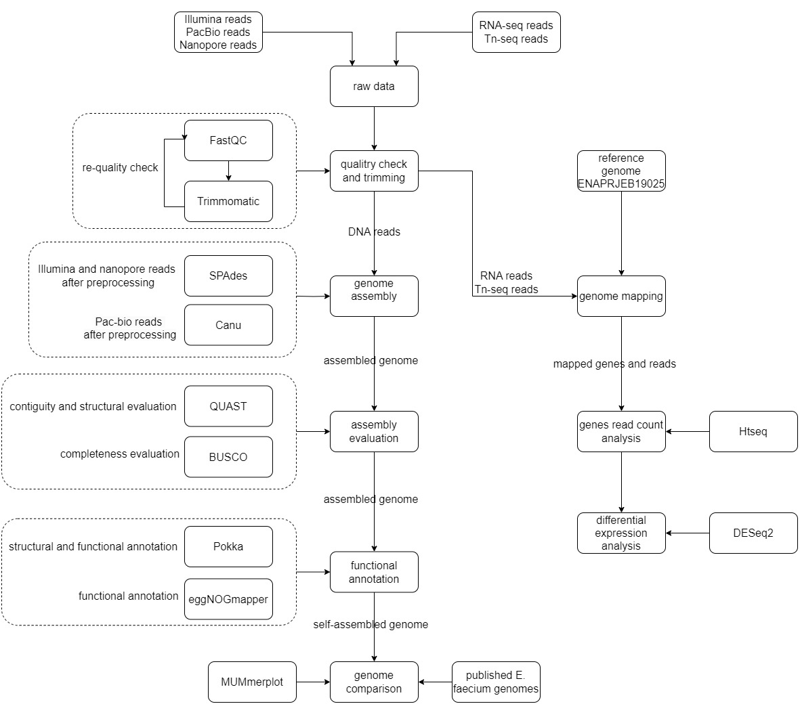
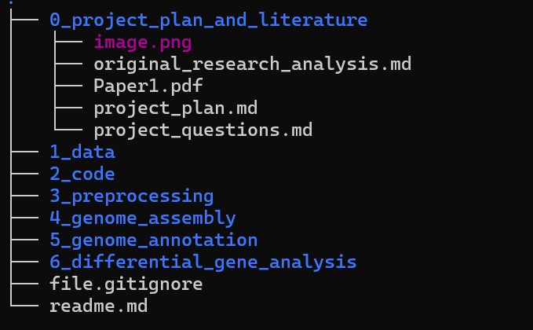

## Project plan - Yuxin Cheng
### 1. Aim of project

The overall aim of this project is to reproduce the main analyses of the study on E. faecium survival and growth in human serum, and to further extend the study through additional analyses in order to better understand the genetic basis and biological mechanisms underlying bloodstream adaptation and pathogenicity.

**More specifically, the project aims to:**
-  Reproduce the key results related to genes associated with E. faecium growth in human serum;
-  Examine the biological functions and pathways of candidate genes involved in serum survival and proliferation;
-  Perform additional analyses to further evaluate the robustness, functional relevance, or broader pathogenic significance of these genes.

**And the aim can be specify to listed questions:**
1. How can a reliable reference genome of E. faecium be assembled, evaluated, and annotated?
2. How does the assembled genome position within the phylogenetic and mobile genetic element context of related E. faecium strains?
3. How does gene expression in E. faecium differ between rich medium (BHI) and heat-inactivated human serum?
4. Which genes and pathways are differentially expressed under serum conditions?
5. What regulatory or functional mechanisms may underlie these differential expression patterns?
6. How may these serum-responsive genes and mechanisms contribute to pathogenicity in humans, and what implications might they have for future therapeutic or preventive strategies?

The following plan is designed based on the specified questions. And question 1-5 are the main part for analysis.

---

### 2. Analysis

| Analysis block | Analysis method in this project | Software in this project | Input data | Data source | Reason for the project choice | Estimated time (2 cores) |
|---|---|---|---|---|---|---|
| Reads quality control | Quality check of Illumina reads before and after preprocessing | FastQC | Raw Illumina DNA-seq reads and RNA-seq reads (FASTQ) | RNA-seq reads from ENA PRJEB19025; Illumina reads generated from E. faecium E745 genome sequencing (as described in the paper) | This is required by the project and is a standard first step for reproducible downstream analysis. | ~10 min |
| Short reads preprocessing | Adapter and quality trimming of Illumina short reads | Trimmomatic | Raw Illumina reads (FASTQ) | Same Illumina sequencing datasets used for genome polishing and RNA-seq in the paper | The paper used Illumina reads in downstream assembly correction and RNA-seq analysis, so trimming is a reasonable standard preprocessing step in the project workflow. | ~30 min per file |
| DNA assembly | PacBio-based bacterial genome assembly | Canu | PacBio long reads (FASTQ/FASTA) | PacBio RS II SMRT sequencing data generated from E. faecium E745 (paper dataset) | Canu is the closest long-read assembler in the provided software list for reproducing the PacBio-led assembly logic of the paper. | ~6 h |
| Assembly evaluation | Statistical assembly evaluation | QUAST | Assembled genome contigs (FASTA) | Assembly generated in this project (based on PacBio reads) | QUAST provides a standardized evaluation of contiguity and assembly quality suitable for a course project. | <10 min |
| Structural and functional annotation | Structural and functional annotation of the assembled bacterial genome | Prokka | Assembled genome (FASTA) | Final assembled genome corresponding to E. faecium E745 (reference deposited in NCBI GenBank CP014529–CP014535) | This directly matches the paper and is the most appropriate bacterial annotation tool in the provided list. | <5 min |
| Genome comparison | Genome comparison with a closely related genome | BLAST | Annotated genome (FASTA) + reference genome sequences | Reference genomes and plasmids from NCBI GenBank (e.g. pMG1 plasmid; E. faecium ATCC 700221) | BLAST is explicitly listed in the project software sheet and is a direct executable option for sequence-level genome comparison. | <1 min |
| RNA-seq read alignment | Alignment of bacterial RNA-seq reads against the assembled genome | BWA | Clean RNA-seq reads (FASTQ) + assembled genome (FASTA) | RNA-seq dataset from ENA PRJEB19025; reference genome from this study | Among the provided aligners, BWA is the most suitable listed option for bacterial RNA reads aligned to a bacterial reference genome. | ~15–20 min per paired-end dataset |
| Differential expression analysis | Read counting followed by differential expression testing | HTSeq + DESeq2 | Aligned RNA-seq reads (BAM) + genome annotation (GFF) | BAM files generated from RNA-seq alignment + annotation from Prokka | Since Rockhopper is not in the provided software sheet, HTSeq + DESeq2 is the clearest standard replacement using the available tools. | ~4h |
 
### 3. Extra analyses

| Analysis question | Software | Required input | Expected output | Estimated time (2 cores) |
|---|---|---|---|---|
| Genome assembly with Illumina and Nanopore reads |  SPAdes | Trimmed Illumina reads; trimmed/filterted Nanopore reads | Alternative assembled contigs/scaffolds for comparison with the main assembly | ~4–8 h |
| Assembly evaluation (extra methods) | BUSCO | Assembled genome FASTA file | BUSCO completeness report with proportions of complete, fragmented, and missing benchmark genes | ~1 h |
| Annotation refinement | eggNOGmapper | Predicted protein sequences from the assembled and annotated genome | Refined functional annotation table with orthologous groups and functional categories | ~ 13 h |
| Plasmid identification | BLAST | Assembled contigs or suspected plasmid sequences in FASTA format | BLAST hits indicating similarity to known plasmid sequences or plasmid-associated genes | ~1 min |
| SNP calling | BCFtools | Mapped reads in BAM format; reference genome FASTA | VCF file containing called SNPs and small variant statistics | ~1 h |
| Evaluate antibiotic resistance potential | BLAST | Assembled genome sequence or predicted gene sequences in FASTA format; reference resistance gene database | BLAST hit table of candidate antibiotic resistance genes and their sequence similarity | ~1 min |
| Identify essential genes for growth in human serum based on the Tn-Seq data analysis | DESeq2 | Gene-level count matrix derived from Tn-seq insertion data; sample information table | Differential abundance results highlighting genes significantly depleted after growth in human serum | few min |

---
### 4. Planned Analyses sequence
| Step | Research content | Software | Estimated time (2 cores) |
|---|---|---|---|
| 1 | Quality check of Illumina reads before and after preprocessing | FastQC | ~10 min |
| 2 | Adapter and quality trimming of Illumina short reads | Trimmomatic | ~30 min per file |
| 3 | PacBio-based bacterial genome assembly | Canu | ~6 h |
| 4 | Alternative genome assembly using Illumina and Nanopore reads | SPAdes | ~4–8 h |
| 5 | Statistical assembly evaluation | QUAST | <10 min |
| 6 | Additional assembly completeness evaluation | BUSCO | ~1 h |
| 7 | Structural and functional annotation of the assembled bacterial genome | Prokka | <5 min |
| 8 | Functional annotation refinement | eggNOGmapper | ~1–3 h |
| 9 | Genome comparison with a closely related genome | BLAST | <1 min |
| 10 | Alignment of bacterial RNA-seq reads against the assembled genome | BWA | ~15–20 min per paired-end dataset |
| 11 | Read counting and differential expression analysis | HTSeq + DESeq2 | ~4 h |
| 12 | Identification of candidate genes important for growth in human serum based on Tn-seq count analysis | DESeq2 | ~30 min–2 h |

#### Flowchart for project

---

### 5. Time frame and checkpoints 

| Time point | Project milestone | Required analysis |
|---|---|---|
| 10/4 | Complete project plan | — |
| 21/4 | Complete Genome assembly | FastQC, Trimmomatic, Canu, SPAdes |
| 24/4 | Complete Genome masking | QUAST, BUSCO |
| 28/4 | Complete Genome annotation | Prokka, eggNOGmapper |
| 05/5 | Complete Comparative Genome assembly | BLAST |
| 11/5 | Complete RNA mapping | BWA |
| 13/5 | Reading Counting | HTSeq |
| 19/5 | Differential Gene Expression analysis | DESeq2 |
| 22/5 | Wiki | — |
| 26/5 | Project presentation | — |

---

### 6. Project directory and file arrangement

The folder `0_project_plan_and_literature` contains the planning documents, research questions, literature files, and background materials that define the scope of the project.

The folder `1_data` is intended for data organization and indexing rather than for storing the full raw datasets. 

The folder `2_code` is intended for scripts organization and all codes for the whole ananlyses workflow will be stored in the file. 

The remaining folders store the output results, parameter setting and sumamry tables for each step in the work flow.

`file.gitignore` records the file types don't need to sync with github, eg. `1_data`.

`readme` file offers instruction for the whole repository desgin and some useful linux commands.
