## 2.1 FastQC

### Purpose

FastQC was used as the first quality control step for the **short-read datasets** in this project. The main goal was to detect technical problems before downstream analyses such as trimming, assembly, and read mapping.

The FastQC reports were used to inspect:

- per base sequence quality
- per sequence quality scores
- adapter content
- overrepresented sequences
- per base sequence content
- sequence duplication levels
- sequence length distribution

### Input data

FastQC was applied to the short-read datasets, including:

- Illumina genomic reads
- RNA-seq raw reads from BHI & serum
- RNA-seq trimmed reads BHI & serum
- Tn-seq reads from BHI & serum & high nutrition serum

**To be mentioned:**
1. FastQC was **not considered appropriate for Nanopore reads** in this project, because the Nanopore data were provided as `.fasta.gz` files and therefore did not contain per-base quality scores.  
2. PacBio long reads were also not the main focus of FastQC-based quality interpretation here, because the main quality assessment for long-read assembly was instead reflected during assembly and assembly evaluation.

### Quality of the data

#### Illumina genomic reads

The Illumina genomic reads showed overall acceptable quality.  
The main issue was that **read 2 showed a decline in quality toward the 3′ end**, suggesting that trimming of low-quality trailing bases was necessary.  
Adapter contamination appeared to be limited, so the main problem was not adapters but declining terminal quality.

**And the results are shown as below:**
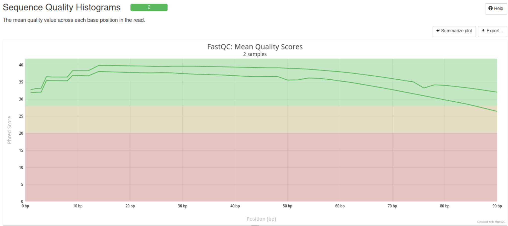
Two sequence have < 1% reads made up of overrepresented sequence.
For more detailed results, can check `7_results_git\preprocessing\multiqc_report_illumina.html`


#### Raw RNA-seq reads

For both the BHI and serum RNA-seq raw reads, the FastQC reports suggested that the raw data required trimming. Results are summarized and shown as below:

1. Results for rna_bh
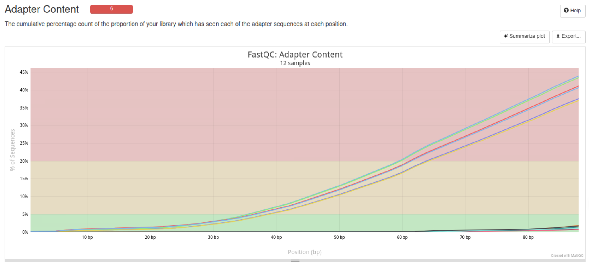
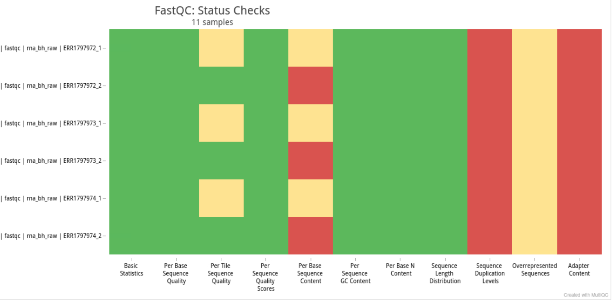
2. Results for rna_serum
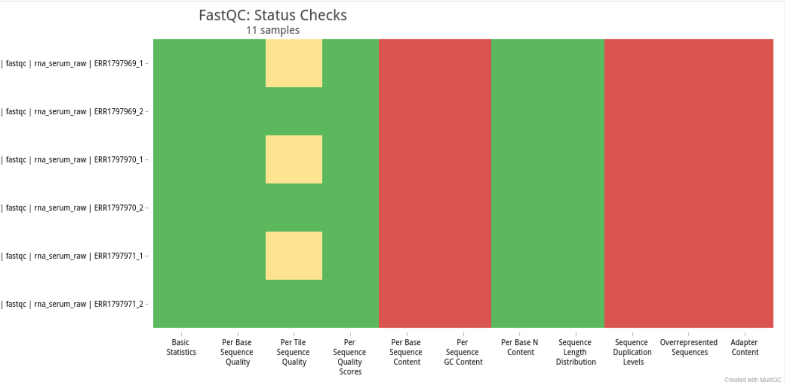

Raw RNA data show **high adapter content**, around **45%**, declining sequence quality toward the read ends and some with high overrepresented sequences. 
``For the overrepresented sequence, whether they are repilcation of genes or the adaptors sequence are unknown. And may need further check the sequence with known adaptor sequences.``

**To be mentioned:**
For RNA-seq, a warning or fail in **Per Base Sequence Content** is not automatically a sign of bad data.  
RNA-seq libraries are not expected to behave like random genomic shotgun libraries, because transcript abundance, transcript structure, and library preparation biases can produce non-uniform base composition across read positions.  
For that reason, the most informative FastQC modules for trimming decisions were: `Per Base Sequence Quality, Adapter Content and Overrepresented Sequences`

#### Trimmed RNA-seq reads
The trimmed RNA-seq read quality improved clearly.
1. Results for rna_bh_trimmed
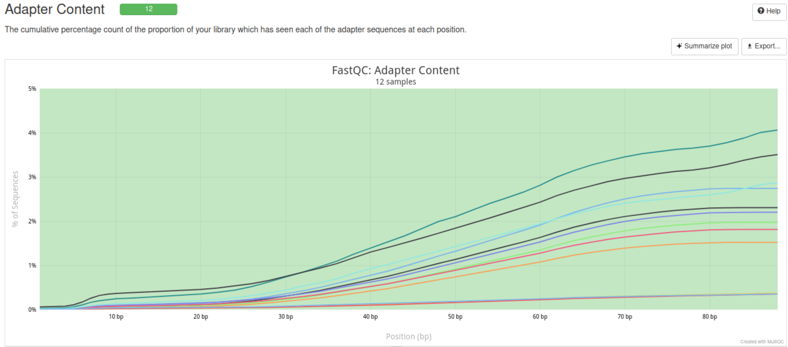
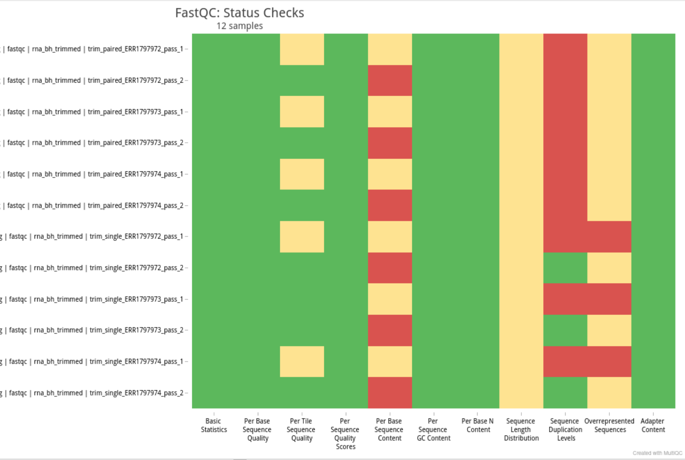
2. Resultes for rna_serum_trimmed
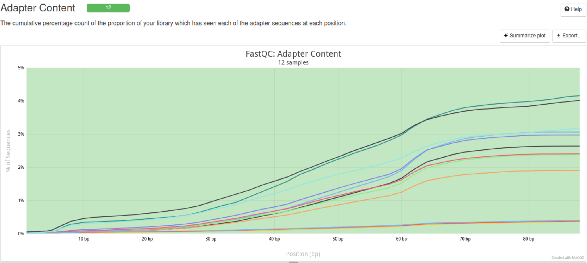
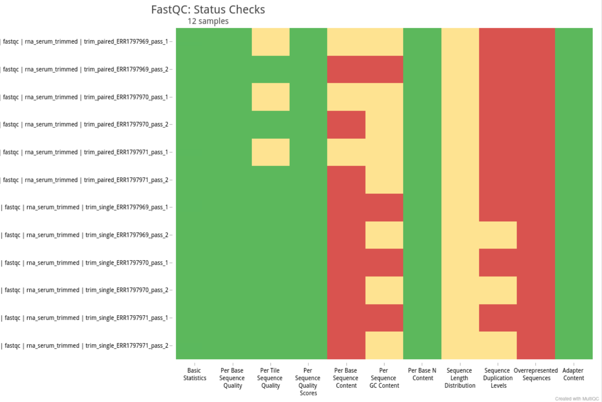

Observed changes:
- adapter content dropped to **below 5%**
- terminal read quality improved
- the trimmed data were more suitable for mapping and expression analysis

**Problems in trimming rna_serum_raw data:**
When deal with `trim_single_ERR1797971_pass_2.fastq.gz
 ` and  `trim_single_ERR1797970_pass_1.fastq.gz`, error file shows `Ran out of data in the middle of a fastq entry`.

Use `gzip -t *.fastq.gz` to check if the files are broken. And use
```bash
# code
for f in *.fastq.gz
do
    echo "Checking $f"
    zcat "$f" | awk 'END {print "lines=" NR, "mod4=" NR%4}'
done

# results
Checking ERR1797969_1.fastq.gz
lines=103749472 mod4=0
Checking ERR1797969_2.fastq.gz
lines=103749472 mod4=0
Checking ERR1797970_1.fastq.gz
lines=106537520 mod4=0
Checking ERR1797970_2.fastq.gz
lines=106537520 mod4=0
Checking ERR1797971_1.fastq.gz
lines=110438460 mod4=0
Checking ERR1797971_2.fastq.gz
lines=110438460 mod4=0
```
The results seem to be normal, so **run trimmomatic bash in RNA seq data of ER1797971 again** to see if the data can be normally trimmed.


#### Tn-seq reads
1. Results for tn_seq_bh
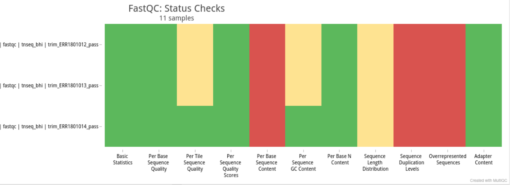
2. Results for tn_seq_hserum
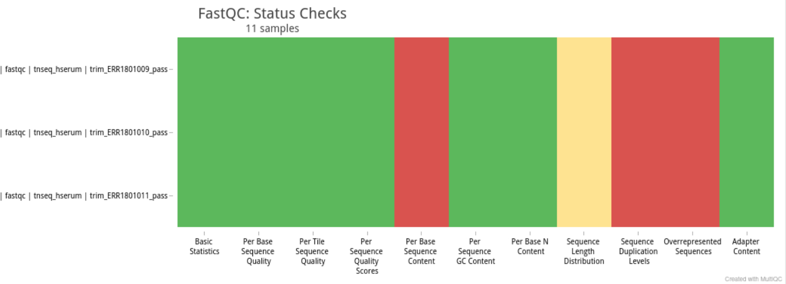
3. Results for tn_seq_serum
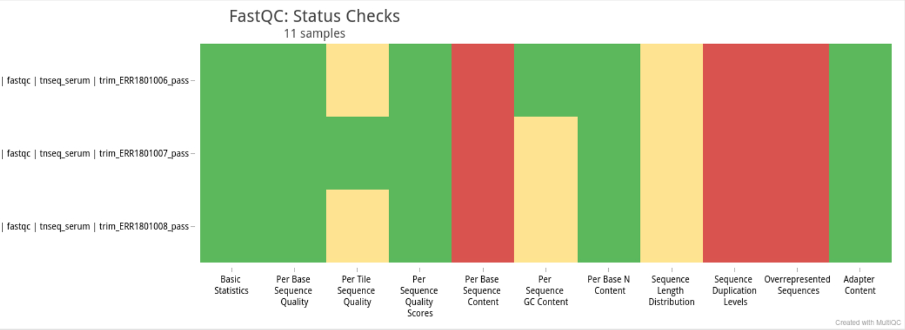

The Tn-seq datasets did not show strong evidence of adapter contamination.  
Based on the low adapter content, these datasets appeared less affected by the types of technical contamination seen in the raw RNA-seq data.

### What can generate FastQC “fails”, and do they matter?

The FastQC “fails” observed in this project can be explained by several different causes:

1. **low-quality 3′ read tails**  
   This is common in Illumina sequencing and can reduce mapping quality or introduce noise in assembly if not trimmed.

2. **adapter contamination**  
   Adapter sequence can interfere with alignment, inflate overrepresented-sequence warnings, and cause false sequence content patterns.

3. **overrepresented sequences**  
   These may represent adapter-derived fragments, but in RNA-seq they can also reflect highly abundant transcripts rather than contamination.

4. **non-random base composition in RNA-seq**  
   A fail in *Per Base Sequence Content* is common in RNA-seq and does not necessarily indicate poor-quality data.

So, not every FastQC fail has the same meaning.  
Some fails reflect **real technical problems that should be corrected**, while others are expected because of the biological or library-specific properties of the dataset.

### Conclusion

The FastQC step showed that:

- the genomic Illumina reads mainly needed **3′ quality trimming**
- the raw RNA-seq reads needed **adapter removal and quality trimming**
- the trimmed RNA-seq reads were substantially improved
- Tn-seq data showed relatively low adapter contamination
- Nanopore FASTA data were not suitable for standard FastQC interpretation


---

## 2.2 Trimmomatic

### Purpose

Trimmomatic was used to remove technical artifacts and low-quality sequence from the short-read datasets before downstream analysis.  
The main aims were:

- remove adapter contamination
- trim low-quality trailing bases
- improve the overall quality of reads used for assembly and mapping
- discard reads that became too short after trimming

### Why trimming was needed

The FastQC reports suggested two main reasons for trimming:

- **quality decay toward the 3′ end**, especially in Illumina read 2 and raw RNA-seq reads
- **substantial adapter contamination** in the raw RNA-seq libraries

Therefore, trimming was expected to improve the reliability of downstream assembly and alignment-based analyses.

### Parameters setting
```bash

TRIM_PARAMS="ILLUMINACLIP:${ADAPTERS}:2:30:10 TRAILING:20 SLIDINGWINDOW:4:20 MINLEN:36"
```

- `ILLUMINACLIP`  
  removes adapter sequences

- `TRAILING:20`  
  removes low-quality bases from the 3′ end when the Phred score is below 20

- `SLIDINGWINDOW:4:20`  
  scans reads with a 4-base window and cuts when the average quality in the window falls below 20

- `MINLEN:36`  
  discards reads shorter than 36 bp after trimming

- `-phred33`  
  specifies Phred+33 quality encoding, which is standard for modern Illumina data

### What quality threshold was chosen, and why?

A threshold of **Q20** was used for trailing and sliding-window trimming.  
This is a common compromise between retaining enough data and removing clearly unreliable base calls.

The logic was:

- a **lower threshold** would keep more reads but also retain more sequencing noise
- a **higher threshold** would be more conservative but could remove too much useful sequence

Using `TRAILING:20` and `SLIDINGWINDOW:4:20` therefore provided a reasonable balance between read retention and quality improvement.

### How many reads were discarded after trimming?

**Trimmomatic summary for DNA and RNA datasets**

| Data class | Dataset / sample | Input read pairs | Both surviving | Forward only surviving | Reverse only surviving | Dropped |
|---|---|---:|---:|---:|---:|---:|
| DNA | Illumina genomic DNA | 1,666,667 | 1,666,564 (99.99%) | 103 (0.01%) | 0 (0.00%) | 0 (0.00%) |
| RNA | RNA-seq BHI, ERR1797972 | 27,078,884 | 13,467,546 (49.73%) | 11,817,441 (43.64%) | 148,033 (0.55%) | 1,645,864 (6.08%) |
| RNA | RNA-seq BHI, ERR1797973 | 23,953,340 | 13,413,988 (56.00%) | 9,231,519 (38.54%) | 145,982 (0.61%) | 1,161,851 (4.85%) |
| RNA | RNA-seq BHI, ERR1797974 | 23,240,177 | 12,141,681 (52.24%) | 9,645,254 (41.50%) | 127,682 (0.55%) | 1,325,560 (5.70%) |
| RNA | RNA-seq BHI, combined summary | 74,272,401 | 39,023,215 (52.54%) | 30,694,214 (41.33%) | 421,697 (0.57%) | 4,133,275 (5.57%) |

**Interpretation**

- **Illumina genomic DNA** was only minimally affected by trimming.  
  Almost all read pairs (99.99%) remained as proper paired-end reads, and no read pairs were completely discarded.

- **RNA-seq BHI** was much more affected by trimming. Although only 4.85%–6.08% of read pairs were completely dropped, a large proportion of reads lost one mate and survived only as singleton reads.

- Across the three **RNA-seq BHI** samples combined, only **52.54%** of input read pairs remained as proper paired-end reads, while **41.33%** survived only as forward reads.

- This pattern is consistent with the **FastQC** results, which showed high adapter content and declining quality toward the 3′ ends in the raw RNA-seq data.

- The difference between the DNA and RNA datasets is technically reasonable: the genomic DNA library was cleaner and more stable, whereas the RNA-seq libraries showed stronger adapter contamination and more pronounced end-quality decay.


### How can trimming affect downstream analyses?

1. For downstream analyses, the **DNA dataset** retained almost all paired-end information after trimming, which is favorable for assembly and mapping. For example, in the Illumina genomic DNA sample, **99.99%** of read pairs remained as proper pairs and **0.00%** were completely dropped.

2. In contrast, the **RNA-seq BHI datasets** were much more strongly affected. Although only **4.85%–6.08%** of read pairs were completely dropped, many reads lost one mate and survived only as singleton reads. Across the three RNA-seq BHI samples combined, only **52.54%** of input read pairs remained as proper pairs, while **41.33%** survived only as forward reads.

3. Trimming improved data quality by removing adapters and low-quality terminal bases, which reduced technical artifacts and made the reads more suitable for downstream mapping and assembly.

4. This improvement is consistent with the post-trimming FastQC results: in the RNA-seq data, **adapter content decreased from ~45% to <5%**, and the strong **3′-end quality decline** was clearly reduced.

5. However, trimming also reduced the amount of retained paired-end data, especially in RNA-seq. Therefore, trimming was beneficial overall, but it came with the trade-off of reduced effective read depth and loss of some pairing information.

6. In this project, trimming was justified because the FastQC results showed clear quality problems that were likely to interfere with downstream analyses if left uncorrected.

---

## 2.3 Re-FastQC

### Illumina
The paired sequences are of relatively good quality, and the sequence_2 didn't show better per base sequence quality afer trimming.
before trimming
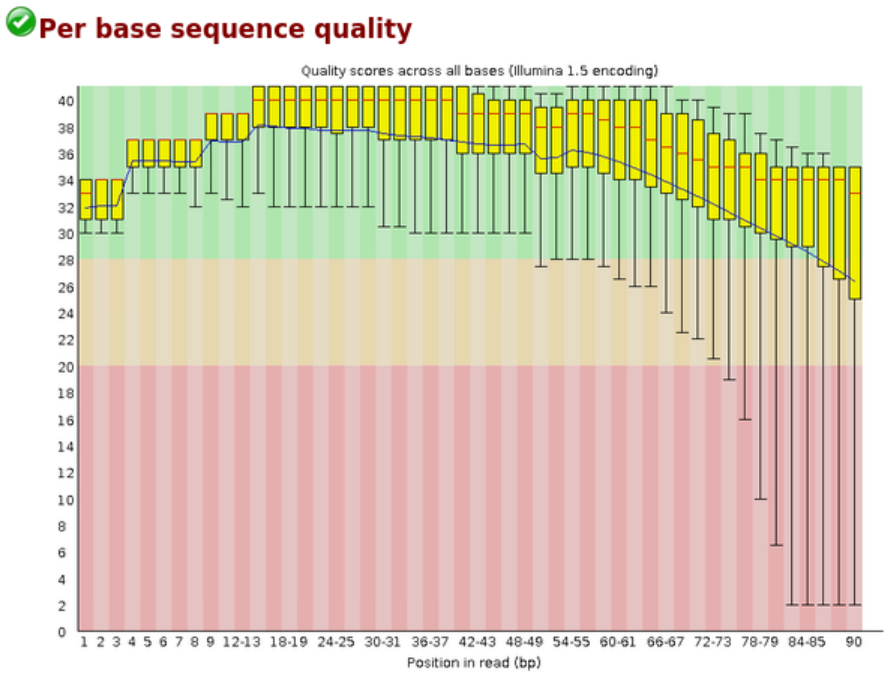
after trimming
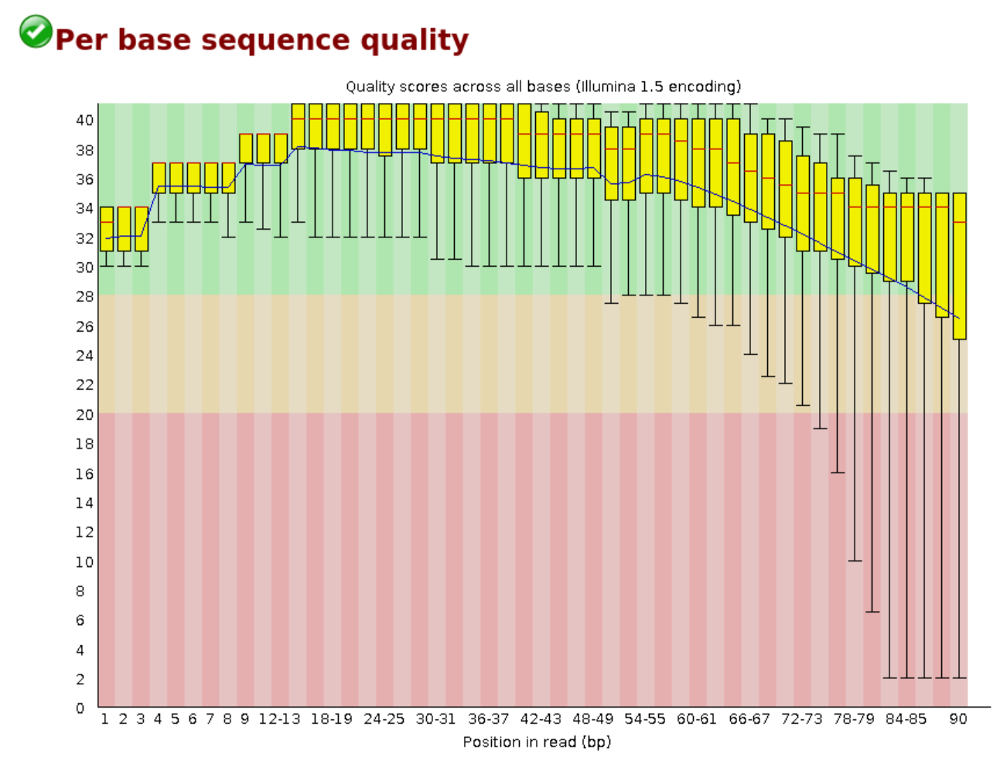
And trimming of Illumina data leaves a forward only surviving sequence of 103bp.
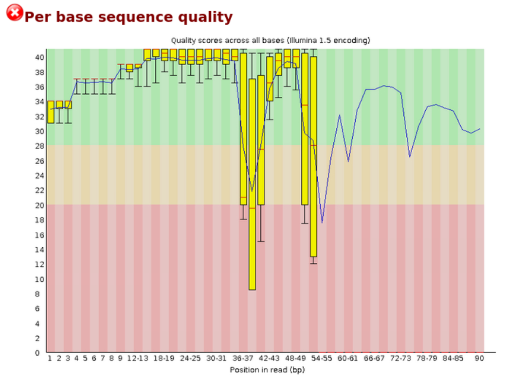
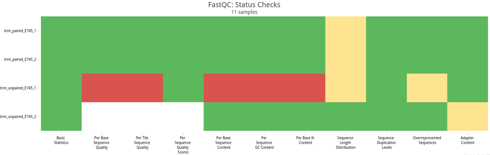
Considering the original data is of overall good quality, so we **use the orginal Illumina data for afterwards genome assembly**.

---

### RNA raw reads

Notably decrease the adaptor content and overrepresented sequence

rna_bh
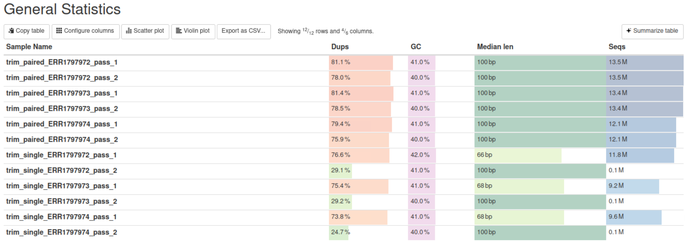
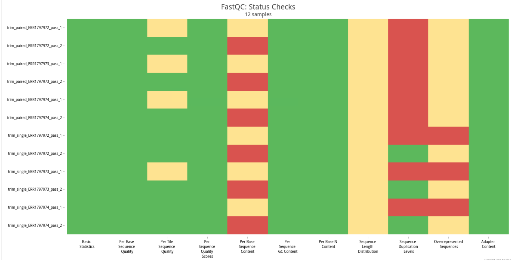

rna_serum


---

## Gene assembly and evaluation

Two assemblers were used in this project:

- **SPAdes** for hybrid assembly using Illumina genomic reads and PacBio reads
- **Canu** for long-read assembly using Nanopore reads

For *E. faecium* E745, the public reference genome consists of **1 chromosome and 6 plasmids**, so an ideal near-complete assembly would approach **7 replicons**. In practice, repeat regions, plasmid complexity, sequencing errors, and coverage limitations often lead to more fragmented draft assemblies.

---

## 3.1 Genome assembly with SPAdes

### Purpose

SPAdes was used to generate a hybrid bacterial genome assembly from paired-end Illumina reads and PacBio reads. The `--isolate` mode was selected because the target genome was a bacterial isolate.

### Assembly strategy

SPAdes uses a **de Bruijn graph** approach. In this method, reads are split into overlapping **k-mers**, which are then used to reconstruct the genome.

- **Small k-mers** improve connectivity in low-coverage regions, but can increase ambiguity in repeats.
- **Large k-mers** improve repeat resolution, but require better read quality and coverage.
- SPAdes addresses this by using **multiple k-mer sizes** internally.

### Main output files

The main SPAdes output files were:

- `contigs.fasta`
- `scaffolds.fasta`
- assembly graph files
- log files

These files are useful for checking assembly contiguity, graph complexity, and the overall progress of the assembly.

### Raw assembly result

The raw SPAdes assembly contained **126 contigs**, which can be checked directly from `contigs.fasta` by counting sequence headers. The **largest contig** was **714,133 bp**.

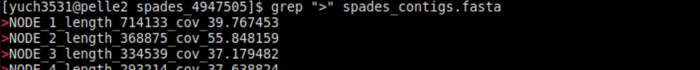


### Interpretation

The SPAdes assembly recovered a large proportion of the genome, but it was still relatively fragmented. This is likely related to repeat structure, plasmid complexity, and the limitations of graph-based assembly in difficult regions.

### Transition to evaluation

A more formal comparison of assembly quality was performed using **QUAST** and **BUSCO**, as raw assembler output alone is not sufficient to assess overall assembly quality.

---

## 3.2 Genome assembly with Canu

### Purpose

Canu was used for long-read assembly based on Nanopore reads.

Input used in this analysis:

- Nanopore reads: `E745_all.fasta.gz`
- estimated genome size: **2.8 Mb**

### Assembly strategy

Canu uses an **overlap-layout-consensus (OLC)** strategy, which is well suited for noisy long-read data. Unlike de Bruijn graph assemblers, Canu is designed to use long-read overlap information to build more contiguous assemblies.

Canu also performs **read correction** before the final assembly step. This correction step reduces sequencing errors by comparing overlaps among reads and improves the quality of the input used for contig construction.

### Initial assembly problem

The first Canu run report error.
```bash
-- Corrected reads saved in 'E745_canu.correctedReads.fasta.gz'. 
-- Finished stage 'cor-dumpCorrectedReads', reset canuIteration. 
-- -- ERROR: Read coverage (2.59) lower than allowed. -- ERROR: stopOnLowCoverage = 10 
-- ERROR: 
-- ERROR: This could be caused by an incorrect genomeSize or poor 
-- ERROR: quality reads that cound not be sufficiently corrected. 
-- ERROR: 
-- ERROR: You can force Canu to continue by decreasing parameter 
-- ERROR: stopOnLowCoverage (and possibly minInputCoverage too). 
-- ERROR: Be warned that the quality of corrected reads and/or 
-- ERROR: contiguity of contigs will be poor. 
-- ABORT: ABORT: canu 2.3 ABORT: Don't panic, but a mostly harmless error occurred and Canu stopped. ABORT: Try restarting. If that doesn't work, ask for help. ABORT:
```
- reported read coverage: **2.59**
- default `stopOnLowCoverage`: **10**

This suggested that the usable long-read coverage was insufficient under the default settings, so the low-coverage thresholds had to be relaxed before rerunning the assembly. So the  `stopOnLowCoverage` is changed to 2.

```bash
canu \
  -p "${PREFIX}" \
  -d "${OUTDIR}" \
  genomeSize="${GENOME_SIZE}" \  # 2.8m
  useGrid=false \
  maxThreads=2 \
  corThreads=2 \
  corConcurrency=1 \
  stopOnLowCoverage=2 \
  minInputCoverage=1 \
  samtools="$(which samtools)" \
  -pacbio "${PACBIO_MERGED}"
```

### Assembly result

After parameter adjustment and rerunning, the final Canu assembly improved substantially:
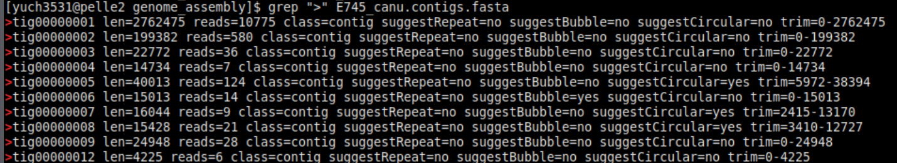
- **10 contigs**
- **total length:** 3,115,034 bp
- **largest contig:** 2,762,475 bp
- **N50:** ~2 Mb
- **BUSCO completeness:** 98.3%


### Interpretation

Compared with SPAdes, the final Canu assembly was much more contiguous and structurally more suitable for downstream analyses such as chromosome-level interpretation, plasmid organization, and genome annotation on longer contigs.

### Transition to evaluation

Because raw assembly size and contig count alone are not enough to judge assembly quality, the final comparison was based on **QUAST** and **BUSCO** results.

---

## 4.1 QUAST

### Purpose

QUAST was used to compare the assemblies using standard assembly statistics, including:

- number of contigs
- total assembly length
- largest contig
- N50
- length distribution under different contig thresholds

### Reference genome

The public *E. faecium* E745 reference genome consists of one chromosome and six plasmids:

| Replicon | Size (bp) | Accession |
|---|---:|---|
| Chromosome | 2,765,010 | CP014529 |
| pE745-1 | 223,688 | CP014530 |
| pE745-2 | 32,423 | CP014531 |
| pE745-3 | 9,310 | CP014532 |
| pE745-4 | 17,254 | CP014533 |
| pE745-5 | 55,167 | CP014534 |
| pE745-6 | 65,558 | CP014535 |

Expected total genome size: **3,168,410 bp**

### QUAST comparison

| Assembly | Total length (bp) | Largest contig (bp) | Contigs (filtered) | Interpretation |
|---|---:|---:|---:|---|
| SPAdes | 3,126,575 | 714,133 | 36 | More fragmented |
| Canu | 3,115,034 | 2,762,475 | 10 | Much more contiguous |

### Interpretation

Both assemblies recovered most of the expected genome size, but both were slightly shorter than the public reference. This may reflect unresolved repeats, incomplete plasmid reconstruction, collapsed regions, or differences in assembly input and sequencing technology.

The main QUAST result is that the **Canu assembly was much more contiguous**, while the **SPAdes assembly remained more fragmented**.

### Conclusion

Based on QUAST, the final Canu assembly was the stronger draft assembly in terms of contiguity, although the public reference genome remained the best-resolved finished assembly.

---

## 4.2 BUSCO

### Purpose

BUSCO was used to evaluate assembly completeness based on expected conserved single-copy bacterial genes.

### BUSCO dataset

The lineage dataset used was: **`bacteria_odb12`**
This was appropriate because *E. faecium* is a bacterial genome.

### BUSCO comparison
canu
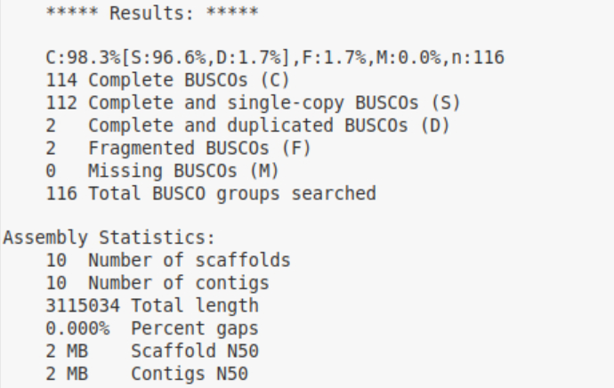
spades
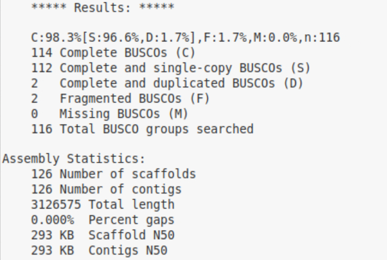

| Assembly | Complete | Single-copy | Duplicated | Fragmented | Missing | Contigs | Total length (bp) |
|---|---:|---:|---:|---:|---:|---:|---:|
| SPAdes | 98.3% | 96.6% | 1.7% | 1.7% | 0.0% | 126 | 3,126,575 |
| Canu | 98.3% | 96.6% | 1.7% | 1.7% | 0.0% | 10 | 3,115,034 |

### Interpretation

BUSCO showed that both assemblies recovered nearly all expected conserved bacterial genes. Therefore, both assemblies were highly complete at the gene-content level.

However, BUSCO did not distinguish the two assemblies in terms of structural quality. Although the BUSCO scores were essentially identical, the QUAST results showed a clear difference in contiguity. This means that the main difference between SPAdes and Canu was not gene recovery, but fragmentation and large-scale assembly structure.

### Fragmented and duplicated BUSCO genes
canu
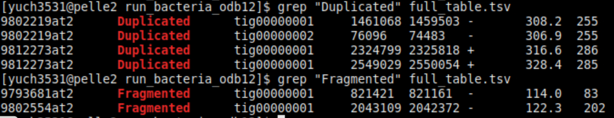
spades
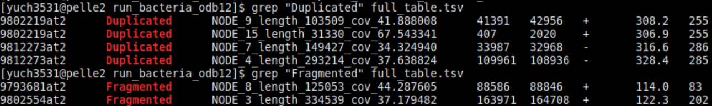


### Conclusion

BUSCO confirmed that both assemblies were highly complete, but when combined with QUAST, the final Canu assembly was still the preferred assembly because it had the same completeness with much stronger contiguity.

---

## Overall conclusion

Both SPAdes and Canu produced assemblies that recovered most of the *E. faecium* E745 genome. SPAdes generated a useful draft assembly with high completeness, but it remained fragmented. After rerunning with adjusted parameters, Canu produced a much more contiguous assembly while maintaining the same BUSCO completeness.

Therefore, the **final Canu assembly** was considered the more suitable assembly for downstream genome-level analyses in this project.
