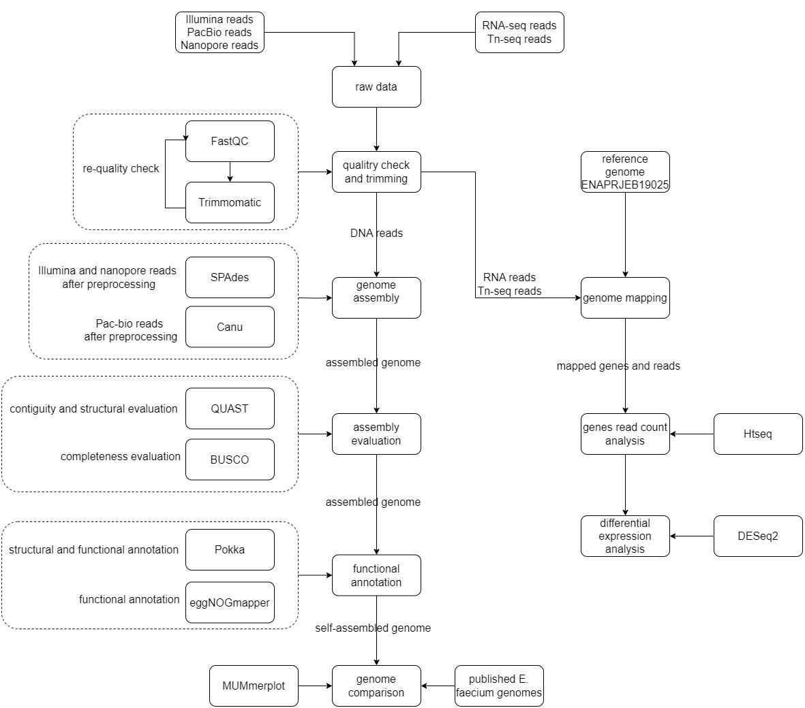

# *Enterococcus faecium* E745 genome and serum-adaptation analysis

This repository contains a reproducible genome-analysis project focused on the
vancomycin-resistant clinical isolate *Enterococcus faecium* E745. The project
reproduces and extends analyses from the original serum-survival study by
combining genome assembly and annotation with RNA-seq, Tn-seq, and antimicrobial
resistance screening.

The central biological question is how *E. faecium* adapts to human serum and
which genes may support its growth or survival in a bloodstream-like
environment. Detailed methods, results, figures, and interpretation are
available in the [project Wiki](https://github.com/YucinC/genome_analysis_project/wiki).

## Project objectives

- Assemble, evaluate, and annotate the *E. faecium* E745 genome.
- Compare SPAdes and Canu assemblies using QUAST, BUSCO, and MUMmer.
- Identify genes differentially expressed between BHI and heat-inactivated
  human serum using RNA-seq.
- Identify genes whose disruption changes mutant abundance in BHI, serum, or
  heat-treated serum using Tn-seq.
- Integrate RNA-seq, Tn-seq, and functional annotation to prioritize candidate
  serum-adaptation genes and pathways.
- Assess antimicrobial resistance potential with ResFinder and PointFinder.

## Workflow

| Stage | Main tools | Purpose |
|---|---|---|
| Read quality control | FastQC, MultiQC, Trimmomatic | Inspect and trim genomic, RNA-seq, and Tn-seq reads |
| Genome assembly | SPAdes, Canu | Generate short-/hybrid-read and long-read assemblies |
| Assembly evaluation | QUAST, BUSCO, MUMmer/NUCmer | Compare contiguity, completeness, and reference-level collinearity |
| Genome annotation | Prokka, eggNOG-mapper | Predict genome features and assign functional annotations |
| RNA-seq analysis | BWA, HTSeq-count, DESeq2 | Quantify and compare expression in BHI and heat-inactivated serum |
| Tn-seq analysis | Bowtie2, HTSeq-count, DESeq2 | Detect condition-dependent changes in mutant insertion abundance |
| AMR screening | ResFinder, PointFinder | Predict acquired resistance determinants and resistance-associated mutations |

## Main results

### Genome assembly and annotation

- SPAdes and Canu recovered most of the expected E745 genome, and both reached
  **98.3% BUSCO completeness** with the `bacteria_odb12` dataset.
- The Canu assembly was selected as the working assembly because it was more
  contiguous: **3,115,034 bp in 10 contigs**, with a largest contig of
  **2,762,475 bp**. SPAdes showed clearer direct collinearity with the published
  E745 reference but was more fragmented.
- Prokka predicted **3,093 CDS**, 70 tRNAs, and 1 tmRNA in the Canu assembly.
- eggNOG-mapper annotated **2,892 of 3,093 proteins (93.5%)**. Prokka still
  classified 1,361 CDS (44.0%) as hypothetical proteins, highlighting the need
  for cautious interpretation and further validation.

### RNA-seq

- DESeq2 identified **1,246 significant genes** at `padj < 0.05` and
  `|log2FoldChange| >= 1`: 630 had higher expression in serum and 616 had higher
  expression in BHI.
- PCA separated BHI and serum samples along PC1, which explained **99.23%** of
  the variance, and within-condition replicates clustered together.
- Recovered signals involved nucleotide metabolism, peptide and nutrient
  transport, carbohydrate metabolism, and stress responses.

### Tn-seq and integrated interpretation

- Tn-seq-specific trimming improved Bowtie2 mapping to approximately **73-84%**
  across samples.
- Genes including `purA`, `purQ`, `purH`, `pyrF`, `rpoN1`, and `ptsI` showed
  lower mutant abundance in serum-related comparisons, suggesting
  condition-dependent contributions to growth or survival.
- Candidates supported by both local RNA-seq and Tn-seq evidence included
  `purA`, `purQ`, `purH`, `pyrC`, `rpoN1`, `brnQ_1`, and `menE`.
- Together, the results emphasize nucleotide biosynthesis, nutrient acquisition,
  carbohydrate transport, stress adaptation, and transcriptional regulation as
  candidate components of serum adaptation.

RNA-seq measures transcript abundance, whereas Tn-seq measures mutant fitness or
insertion abundance. Agreement between the two strengthens candidate
prioritization, but it does not by itself establish a molecular mechanism or
universal gene essentiality.

### Antimicrobial resistance potential

ResFinder detected `aac(6')-Ii`, `msr(C)`, and `VanHAX` determinants, while
PointFinder reported resistance-associated mutations in `gyrA`, `parC`, and
`pbp5`. These are genotype-based predictions and should be confirmed with
curated review and phenotypic susceptibility testing.

## Repository structure

| Path | Contents |
|---|---|
| [`0_project_plan_and_other_files/`](0_project_plan_and_other_files/) | Project plan, research questions, source paper, workflow diagram, and background material |
| [`2_code/all_code_clean/`](2_code/all_code_clean/) | Consolidated Bash/SLURM and R scripts for the analysis workflow |
| [`4_genome_assembly/`](4_genome_assembly/) | Assembly-evaluation outputs |
| [`5_genome_annotation/`](5_genome_annotation/) | eggNOG-mapper functional-annotation results |
| [`7_results_git/`](7_results_git/) | Selected QC, assembly, annotation, RNA-seq, Tn-seq, and AMR results |
| [`8_Interpretation_supporting_tables/`](8_Interpretation_supporting_tables/) | Summary tables used in the final interpretation |
| [`file.gitignore`](file.gitignore) | File patterns excluded from version control |

Raw sequence data, large alignment files, indexes, temporary files, and most
intermediate outputs are intentionally not tracked in Git.

## Documentation

The Wiki provides the complete analysis narrative:

1. [Analysis of the original research](https://github.com/YucinC/genome_analysis_project/wiki/0_Analysis-of-orginal-research)
2. [Project plan](https://github.com/YucinC/genome_analysis_project/wiki/1_Project-plan)
3. [Data preprocessing](https://github.com/YucinC/genome_analysis_project/wiki/2_Data-preprocessing)
4. [Genome assembly](https://github.com/YucinC/genome_analysis_project/wiki/3_Genome-assembly)
5. [Genome assembly evaluation](https://github.com/YucinC/genome_analysis_project/wiki/4_Genome-assembly-evaluation)
6. [Genome annotation](https://github.com/YucinC/genome_analysis_project/wiki/5_Genome-annotation)
7. [Differential gene-expression analysis](https://github.com/YucinC/genome_analysis_project/wiki/6_Differnential-genes-expression-analysis)
8. [Tn-seq analysis](https://github.com/YucinC/genome_analysis_project/wiki/7_Tn_seq_analysis)
9. [Integrated biological interpretation and question coverage](https://github.com/YucinC/genome_analysis_project/wiki/8_Biological_interpretation%26question_check)

## Data sources

- RNA-seq and Tn-seq study data: ENA BioProject
  [PRJEB19025](https://www.ebi.ac.uk/ena/browser/view/PRJEB19025)
- Published *E. faecium* E745 reference genome: GenBank accessions
  `CP014529-CP014535`

## Reproducing the analysis

The cleaned workflow scripts are in
[`2_code/all_code_clean/`](2_code/all_code_clean/). They are organized by
analysis stage rather than as a single workflow runner. Before execution, review
the input/output paths, software modules, database locations, and SLURM resource
settings for the target computing environment.

A practical execution order is:

1. Run FastQC/MultiQC and Trimmomatic preprocessing.
2. Build SPAdes and Canu assemblies.
3. Evaluate the assemblies with QUAST, BUSCO, and MUMmer.
4. Annotate the selected assembly with Prokka and eggNOG-mapper.
5. Map and count RNA-seq reads, then run the RNA-seq DESeq2 analysis.
6. Trim, map, and count Tn-seq reads, then run the Tn-seq DESeq2 analyses.
7. Integrate the result tables with Prokka/eggNOG annotations and AMR predictions.

See the Wiki pages linked above for exact parameters, quality-control decisions,
result figures, comparisons with the original study, and interpretation limits.
